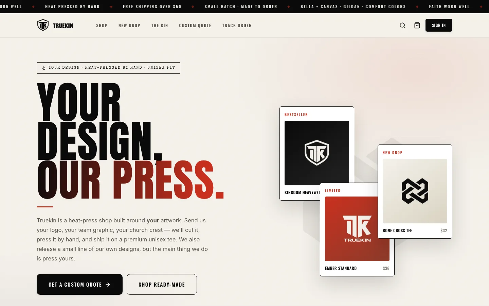
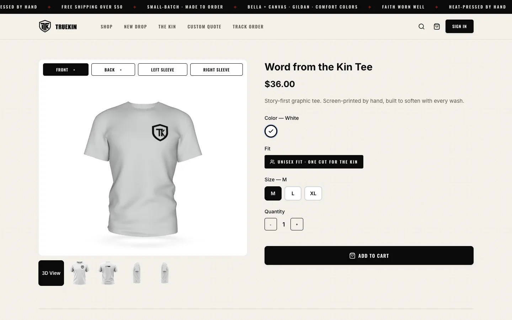
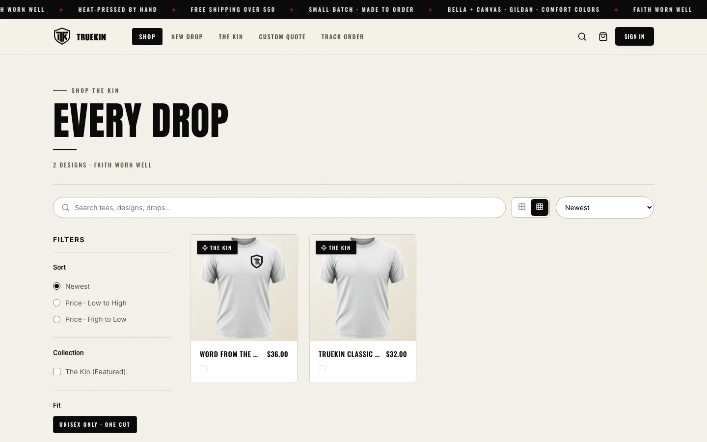
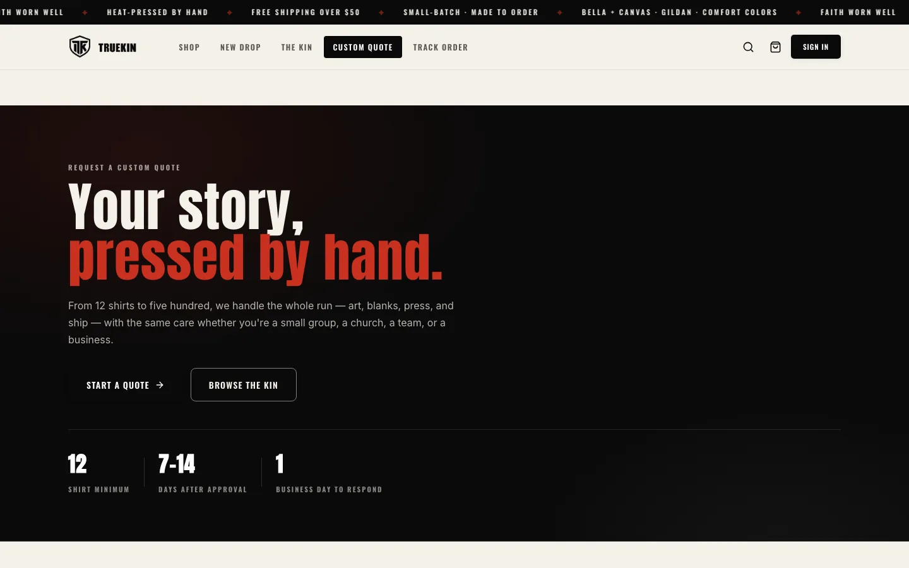
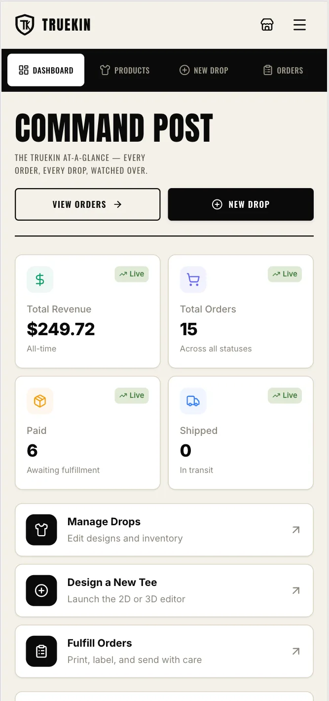
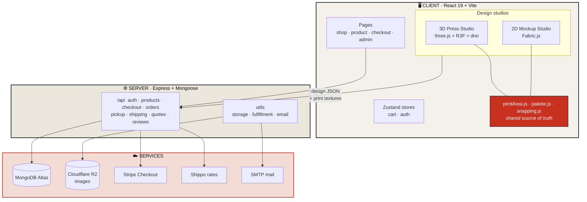
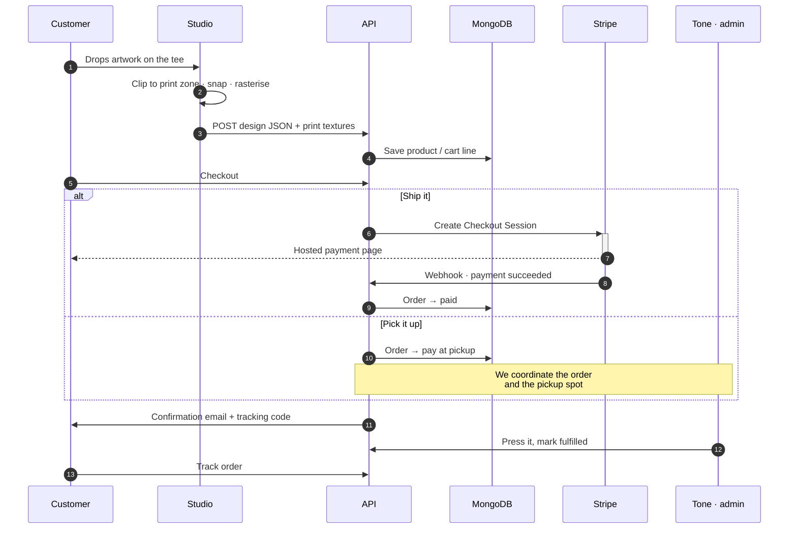

<div align="center">

<picture>
  <source media="(prefers-color-scheme: dark)" srcset="client/public/design-assets/brand/truekin-lockup-bone.webp">
  <source media="(prefers-color-scheme: light)" srcset="client/public/design-assets/brand/truekin-lockup-ink.webp">
  
</picture>

### Your design, our press.

**A heat-press shop on the web.** Customers send their artwork — a church crest, a team graphic, a logo — and place it on a premium unisex tee in a real design studio, in 2D or in 3D. Then we cut it, press it by hand, and ship it.

<br>

[](https://nodejs.org) [](https://react.dev) [](https://threejs.org) [](http://fabricjs.com)

[](https://www.mongodb.com/atlas) [](https://stripe.com) [](https://goshippo.com) [](https://tones-tees-1902266a6f18.herokuapp.com/)

**[Live store →](https://tones-tees-1902266a6f18.herokuapp.com/)**

</div>

<br>

---

<br>

<div align="center">
  
</div>

<table>
<tr>
<td width="50%"></td>
<td width="50%"></td>
</tr>
<tr>
<td align="center"><b>Product</b> · orbit the tee, or flip to front / back / either sleeve</td>
<td align="center"><b>Shop</b> · search, sort, filter — one unisex cut, no gendered split</td>
</tr>
<tr>
<td width="50%"></td>
<td width="50%" align="center"></td>
</tr>
<tr>
<td align="center"><b>Custom quote</b> · bulk runs from 12 shirts up</td>
<td align="center"><b>Admin, on a phone</b> · the whole console, studios included</td>
</tr>
</table>

<br>

---

## `01` · What it does

|  | |
|---|---|
| **Two design studios** | A 3D press studio (orbitable tee, real cloth shading) and a 2D mockup studio (flat photo mockups). Same print zones, same colours, same output — pick the one you like. |
| **Four print views** | Front, back, left sleeve, right sleeve. Sleeve zones are derived from a side-view photo, so a sleeve print is a sleeve print in both editors. |
| **Type, art & effects** | Text with presets and curved type, uploaded images, a built-in brand asset library, shapes, and outline/shadow effects — all on a Fabric.js canvas. |
| **Magnetic snapping** | Edges and centres catch the print-zone guides; rotation locks to 45° then 15°. Hysteresis means a snap holds instead of chattering. |
| **Any colour you like** | Twelve studio-photographed blanks plus a custom colour picker. Custom hexes are re-shaded from the white tee's own luminance, so the fabric folds survive the dye. |
| **Checkout** | Stripe Checkout, Shippo live shipping rates, order confirmation email, and a public order tracker. |
| **Local pickup** | Pay online or **pay at pickup**. We coordinate the order and the pickup spot with you; a set location is optional. |
| **Custom quotes** | A bulk-order request flow for churches, teams and businesses — 12 shirt minimum. |
| **Admin console** | Products (with drag-to-reorder images and a configurable hover shot), orders, pickup locations, and both studios — fully usable on a phone. |

<br>

## `02` · How it fits together



<br>

### The order, end to end



<br>

## `03` · Built with

<table>
<tr><td valign="top" width="33%">

**Front of house**

- React 19 · Vite 5
- React Router 7
- Zustand 5
- lucide-react · react-hot-toast

</td><td valign="top" width="33%">

**The studios**

- three.js r183
- @react-three/fiber 9 · drei 10
- maath (easing)
- Fabric.js 7

</td><td valign="top" width="33%">

**Back of house**

- Express 4 · Mongoose 8
- JWT + bcryptjs
- Multer + sharp
- Stripe · Shippo · nodemailer
- Cloudflare R2 (S3 SDK)

</td></tr>
</table>

<br>

## `04` · Run it locally

```bash
git clone https://github.com/EAnthonycarranza/TrueKin.git
cd TrueKin
npm run install:all
```

Create `server/.env` (see the table below), then:

```bash
npm run dev
```

Client on **`5173`**, API on **`5001`** — Vite proxies `/api` and `/uploads` across, so there is nothing to configure.

Want sample products to look at?

```bash
npm run seed
```

<details>
<summary><b>Environment variables</b></summary>

<br>

| Variable | Required | What it's for |
|---|:---:|---|
| `MONGODB_URI` | ● | MongoDB Atlas connection string |
| `JWT_SECRET` | ● | Signs session cookies |
| `JWT_EXPIRE` | | Token lifetime (e.g. `7d`) |
| `ADMIN_EMAIL` · `ADMIN_PASSWORD` | ● | Seeds the first admin account |
| `CLIENT_URL` | ● | Origin for CORS and Stripe redirects |
| `PORT` · `NODE_ENV` | | Defaults to `5000` / `development` |
| `STRIPE_SECRET_KEY` | ● | Checkout Sessions |
| `STRIPE_WEBHOOK_SECRET` | ● | Verifies payment webhooks |
| `SHIPPO_API_KEY` | | Live shipping rates at checkout |
| `SMTP_HOST` · `SMTP_PORT` · `SMTP_USER` · `SMTP_PASSWORD` · `EMAIL_FROM` | | Order confirmations |
| `STORE_NAME` · `STORE_STREET` · `STORE_CITY` · `STORE_STATE` · `STORE_ZIP` · `STORE_COUNTRY` · `STORE_PHONE` · `STORE_EMAIL` | | Ship-from address and contact details |
| `R2_ACCOUNT_ID` · `R2_ACCESS_KEY_ID` · `R2_SECRET_ACCESS_KEY` · `R2_BUCKET` | | Cloudflare R2 image storage |
| `R2_PUBLIC_BASE_URL` | | Serve images straight from R2 instead of through the dyno |

Without R2 credentials the server falls back to local disk — fine for development, **not** for Heroku (see note `05.4`).

</details>

<details>
<summary><b>Project layout</b></summary>

<br>

```
TrueKin/
├── client/
│   ├── public/design-assets/brand/   Brand artwork + alpha masks
│   └── src/
│       ├── api/            Fetch wrapper for /api
│       ├── components/
│       │   ├── brand/      Mask-based, tintable logo marks
│       │   ├── designer/   2D studio · Fabric canvas · 3D model & rig
│       │   └── shirt3d/    3D studio + the shared studio core
│       │       ├── printArea.js   ◀ where a design sits — both editors
│       │       ├── palette.js     ◀ swatches — both editors
│       │       ├── snapping.js    ◀ magnetic guides — both editors
│       │       └── mockupTint.js  ◀ colour → mockup photo
│       ├── pages/          Storefront + admin console
│       └── store/          Zustand
└── server/
    ├── controllers/  auth · product · checkout · order · pickup · shipping · quote · review
    ├── models/       User · Product · Order · Quote · Review · PickupLocation
    ├── routes/       One per controller, mounted under /api
    └── utils/        storage (R2) · fulfillment · email
```

</details>

<br>

## `05` · Engineering notes

> The parts that were not obvious. Every one of these is a bug that shipped, got
> found, and left a comment behind in the code.

<br>

**`05.1` — One rectangle rules both studios.**
`printArea.js` defines the print zone once, as fractions of the 450×500 design canvas.
The 2D studio turns it into a Fabric `clipPath` and the dashed on-canvas guide; the 3D studio
derives the decal's position and size on the mesh from *the same rectangle*, re-expressed against
the shirt's bounding box. Because the 3D placement is computed rather than hand-tuned, artwork
in the top-left of the 2D zone lands in the top-left of the chest in 3D. Sleeves work the same
way, off a side-view photo's silhouette box.

**`05.2` — The 3D tee is coloured by photograph, not by hex.**
Swatch hexes are only identifiers. The actual albedo is sampled from the same studio mockup photo
the 2D canvas uses, which is why a red tee in 3D matches the red tee in 2D exactly. Custom colours
are re-shaded from the white tee's luminance so the fabric's folds and shadows survive the dye.

**`05.3` — Cotton is not plastic, and white sheen is a liar.**
The shirt uses `MeshPhysicalMaterial` with cloth `sheen` over the GLB's baked normal and AO maps.
Two lessons the hard way: a *white* sheen over a saturated dye lays a grey veil across the garment
and turns `#e02d27` red into salmon — so `sheenColor` is eased to the shirt's own colour. And the
print decal must **not** reuse the shirt's normal map: that texture is authored against the shirt's
UVs with a `KHR_texture_transform` of scale 8, while a decal carries its own projected UVs. Sharing
it tiled the weave eight times across the artwork and ringed every print with a dark halo.

**`05.4` — Heroku eats your uploads.**
Dynos have an ephemeral filesystem: anything written to `server/uploads` is destroyed on every
restart, deploy and daily dyno cycle, so product images silently vanished. Images now go to
Cloudflare R2 via the S3 SDK, keyed so that URLs already in Mongo keep resolving unchanged.
Local disk stays as the no-credentials development path.

**`05.5` — Fabric's `drawImage` takes a window, not a fit.**
`Image._renderFill` uses the nine-argument `drawImage`, which crops a *source rectangle* rather than
scaling to fit. Brand SVGs have no intrinsic width or height, so the browser's fallback `` size
disagreed with Fabric's `width`, and every logo arrived cropped to a wedge. Fixed by rasterising SVGs
to an exactly-sized canvas at 1024px before they ever reach Fabric.

**`05.6` — Logos you can recolour.**
The brand marks are real artwork, but they are not `` tags. They are alpha PNGs used as a CSS
`mask-image` over a `currentColor` background — so `color` and `opacity` keep working, and the same
mark sits on the cream hero, the red collection tile and the dark admin rail without a second file.

**`05.7` — Snapping that holds on.**
Fabric recomputes position from the pointer on every mousemove, so a naïve "within N px, align"
releases the moment the cursor drifts. Guides use hysteresis instead: catch at **8px**, release at
**11px**. Rotation locks to the 45° family first and 15° steps second, and stays locked until you
turn well past.

**`05.8` — Centre on the zone, not the canvas.**
New objects are placed at the centre of the *print zone*. On the chest that is nearly the canvas
centre, so the difference is invisible — but a sleeve zone sits high and off to one side, and a
canvas-centred object landed outside the clip path and was never drawn. The sleeve looked like it
had silently swallowed your text.

**`05.9` — A shadow helper that blanks the canvas.**
drei's `<SoftShadows>` injects a shader chunk calling `unpackRGBAToDepth()`, which three r0.183
removed. The fragment shader fails to compile and the canvas renders empty, with no error worth
reading. Softness comes from `<ContactShadows>` instead — parked well below the hem, since a
catcher at `y = -0.62` intersected the shirt and smeared a dark band across the bottom.

<br>

## `06` · Scripts

| | |
|---|---|
| `npm run install:all` | Install root, server and client |
| `npm run dev` | Both servers, concurrently |
| `npm run server:dev` | API only, with nodemon |
| `npm run client` | Vite only |
| `npm run seed` | Sample catalogue |
| `npm run build` | Production client build |
| `npm start` | Serve the built client from Express |

<br>

## `07` · Deploy

Heroku builds the client with `heroku-postbuild` and Express serves `client/dist` in production.

```bash
git push heroku main
```

Set every variable from `04` as a Heroku config var. `.env` is gitignored and stays that way —
secrets live in config vars, never in the repo.

<br>

---

<div align="center">
<br>
<picture>
  <source media="(prefers-color-scheme: dark)" srcset="client/public/design-assets/brand/truekin-shield-bone.webp">
  <source media="(prefers-color-scheme: light)" srcset="client/public/design-assets/brand/truekin-shield-ink.webp">
  
</picture>

**FAITH WORN WELL**

<sub>Small-batch · Made to order · Heat-pressed by hand</sub>

<sub>Bella + Canvas · Gildan · Comfort Colors · One unisex cut</sub>

<br>

<sub>© Truekin. All rights reserved.</sub>

</div>
